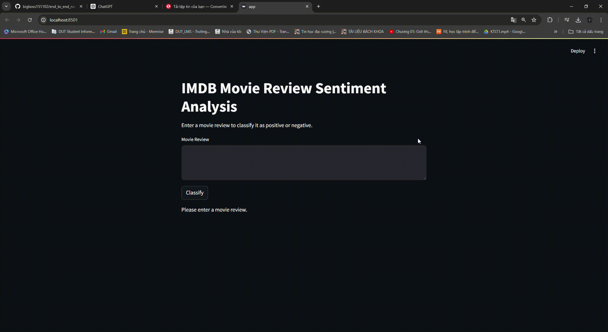

#    Table of Contents
- [Demo](#demo)
- [Description](#description)
- [Installation](#installation)
- [Run Application](#run-application)
- [Contact](#contact)

# Demo


# Description
This project focuses on sentiment analysis of movie reviews using Recurrent Neural Networks (RNNs) on the IMDB dataset. The IMDB dataset is a widely used dataset in sentiment analysis tasks, containing 50,000 movie reviews categorized into positive and negative sentiments. The goal of this project is to develop a model that can accurately classify the sentiment of a given movie review as either positive or negative.

Dataset
The IMDB dataset consists of:

- 25,000 training reviews: Each review is labeled as either positive or negative.
- 25,000 testing reviews: Each review is also labeled and used to evaluate the performance of the model.

The dataset is preprocessed to handle text data, including tokenization, padding, and encoding, to prepare it for training the RNN model.
# Installation
### Create Virtual Environment
Then create new environment where contain nessessary packages to this project.
Ensure you have Python 3.9+ installed.
```cmd
python -m venv .venv
```
Activate new enviroment
```cmd
.venv\Scripts\activate
```
Then, install the required dependencies using pip:
```cmd
pip install -r requirements.txt
```

# Run Application
All done! To run the application, start the Streamlit server:
```cmd
streamlit run app.py
```
Visit the URL shown in your terminal (usually http://localhost:8501) to view the app.


# Contact
For questions, contributions, or bug reports, please feel free to reach out:

- Email: [hoangcongtrong02.dut@gmail.com](hoangcongtrong02.dut@gmail.com)
- Linkedin: [https://www.linkedin.com/in/hoangtrong151102/](https://www.linkedin.com/in/hoangtrong151102/)
- Instagram: [https://www.instagram.com/h.c.trong_02/](https://www.instagram.com/h.c.trong_02/)

I appreciate your feedback and involvement!


